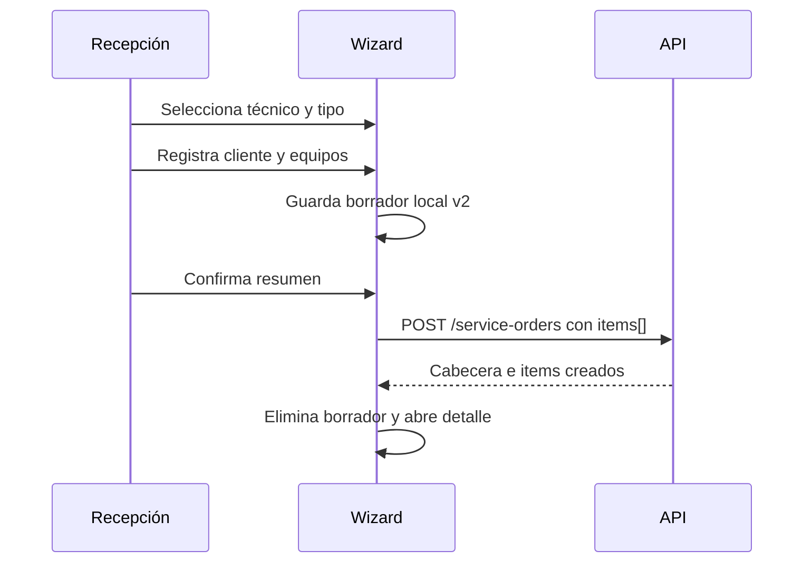

# Design: Interfaz de órdenes con múltiples equipos

## Contexto implementado

`reception-panel.ts`, `technician-panel.ts` y `supervisor-panel.ts` concentran orquestación, formularios y reglas. El wizard ya preserva un borrador local y solicita técnico antes del tipo de servicio, pero envía `POST /service-orders/batch`, que crea órdenes independientes. El inbox ya recibe invalidaciones SSE y refresca de forma focalizada.

## Decisiones

### 1. Modelos de cabecera e item

Los modelos Angular distinguirán:

- `ServiceOrderSummary`: cabecera, estados agregados, conteos y totales.
- `ServiceOrderDetail`: cabecera con `items[]`.
- `ServiceOrderItem`: equipo, prioridad, estados, timestamps y referencias.
- `ServiceOrderItemCommercialVersion` y `ServiceOrderAgreementRevision`.

Las plantillas no leerán `brand`, `model`, `priority` o `serialNumber` directamente de la cabecera.

### 2. Wizard

El orden seguirá siendo:

1. técnico común;
2. tipo de servicio común y origen;
3. cliente/contacto;
4. uno o más equipos;
5. comerciales iniciales cuando corresponda;
6. resumen y creación.

Cada equipo conserva prioridad propia `Baja` por defecto. Agregar o editar un equipo no cambia el técnico ni el tipo de servicio. El borrador local versionará su formato para evitar restaurar payloads batch incompatibles.

La confirmación envía una sola solicitud. El frontend no encadenará creación de acuerdos después de crear la cabecera.

### 3. Paneles por composición

Para no aumentar los componentes monolíticos se extraerán piezas reutilizables:

- cabecera/resumen de orden;
- selector o lista de equipos;
- detalle de equipo;
- historial de diagnósticos;
- compositor comercial por equipo;
- resumen consolidado;
- acciones de cancelación y entrega.

Los paneles siguen controlando qué colección cargar y qué acciones mostrar, pero las reglas de habilitación se moverán a helpers/fachadas testeables.

### 4. Comercial iterativo

La vista consolidada muestra cada equipo con su versión y decisión actuales. Un operador puede editar solo equipos que requieren cambios. Los aceptados aparecen bloqueados y se reutilizan en la siguiente revisión.

El formulario de descuento trabaja por línea, muestra base, descuento y neto, y comunica errores de límite del backend. Técnico, recepción y supervisor ven la acción cuando poseen permiso.

Registrar una respuesta abre un modal corto con decisión, canal y observación. No se simula una respuesta automática del cliente.

### 5. Cancelación

Antes de ejecución se solicita motivo y canal y se confirma la cancelación. Después de ejecución el técnico o recepción solo registran la solicitud; supervisor ve una bandeja/acción para resolver sin cobro, con cobro o rechazar.

La interfaz debe diferenciar “Cancelación solicitada” de “Cancelado” y mostrar bloqueos financieros provenientes del backend.

### 6. Garantía

En tipo de servicio garantía, el campo de serie activa búsqueda exacta. Una coincidencia única puede preseleccionarse mostrando su fuente; varias coincidencias requieren selección. El operador puede desvincularla o continuar sin coincidencia. Se muestran fechas/cobertura como información, nunca como aprobación automática.

### 7. Inbox

El panel derecho usa el título “Órdenes recientes del cliente” y consume contexto calculado por cliente. No habrá selects, chips ni acciones para asociar órdenes a mensajes.

El badge usa `unreadCount` del usuario autenticado. Abrir el hilo llama al endpoint de lectura y actualiza la lista local; SSE mantiene el refresco de mensajes y contadores sin recargar la página.

### 8. Navegación y detalle

“Ver detalles” mantiene el modal. Para una orden con varios equipos, la pestaña general contiene cabecera y selector de equipo; diagnóstico y acuerdo comercial reflejan el equipo elegido y muestran estados vacíos en español cuando no corresponden.

### 9. Compatibilidad de borradores

La clave local cambia a una versión nueva. Un borrador legacy no se envía al API nuevo. La app puede descartarlo con un aviso breve o migrar campos comunes de forma segura, pero nunca debe crear varias órdenes accidentalmente.

## Flujo principal

## Riesgos

- Los paneles actuales son grandes; cada corte debe mantener tests focalizados antes de extraer comportamiento.
- Los cambios locales existentes del wizard e inbox son base funcional y no deben perderse.
- El contrato frontend y backend debe cambiar en el mismo despliegue.
- Todos los textos nuevos deben estar en español peruano.
